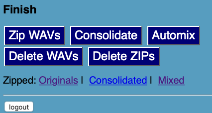

# AUTOMIX/CONSOLIDATE feature

These scripts add to an **automix** feature to an installation of Jamulus Recording Remote, based on the [ffmpeg](https://ffmpeg.org) package. The automix will generate an automatically mixed stereo MP3 from each recording session. Of course, the automix is just a rough preview, with no level adjustment. Panning is done in two ways, discussed below in the Configuration section.In addition to that, a **consolidate** feature is present because needed for automix, but it is also usable independently. This is aimed at producing WAV files that can be used with DAWs different from Reaper and Audacity: tracks all begin at time 0, so it is easy to import them. 



I did not yet include them in the regular distribution because they should be tested, however you can already try it following the steps below. Only the PHP files should be changed. 

First of all,
- install ffmpeg:
```
sudo apt-get install ffmpeg
```
- download the PHP files here listed.

You can already test the system this way:
- `php automix.php single /path/to/recordings/Jam-XXXXXXXX/` creates one mixed mp3 from the tracks of the Jam-XXXXXXXX section.
- `php automix.php all /path/to/recordings/` creates one mixed mp3 from each session inside the recordings directory.

Then, the rest is to enable the web-based interface to automix:

- backup your current PHP files in /var/www/html: 
```
cd /var/www/html
sudo zip /home/ubuntu/backup.zip *.php
```
- create a directory for collecting the mixed files and set the privileges to make it writable by the web server (similar to the recording directory):
```
sudo mkdir /home/jamulus/mix
sudo chgrp www-data /home/jamulus/mix/
sudo chmod g+rwx /home/jamulus/mix/
sudo chmod g+s /home/jamulus/mix/
sudo setfacl -d -m g::rwx /home/jamulus/mix/
```
- the same for consolidated tracks:
```
sudo mkdir /home/jamulus/consolidated
sudo chgrp www-data /home/jamulus/consolidated/
sudo chmod g+rwx /home/jamulus/consolidated/
sudo chmod g+s /home/jamulus/consolidated/
sudo setfacl -d -m g::rwx /home/jamulus/consolidated/
```

- copy the new PHP files to `/var/www/html` . Please note that, if you do not want to rewrite your personalizations in `config.php`, you may avoid overwriting it: you have just to copy the last part of the new `config.php` at the end of your file. 

Everything should be ready now and usable. In the web interface there is a "automix" button that generates an automix for each session of the current day, and zips them in a single file that can be downloaded with the "Mixed" link. The same to consolidate tracks: press the button, wait (a lot) until the button is again enabled. Mix and consolidate zips will be deleted with the "Delete zips" button.

## Configuration
Without any specific configuration, the system attempts to pan the tracks in a uniformly distributed way (I hope). One player: centered; two: on per side (but not totally); three: one centered, one left, one right; etc. 

However, since the system is prevalently aimed at private servers, in config.php you may set the name of each musician/singer exactly as in their Jamulus profile, and set the position relative to left (1.0= all left, 0= all right, 0.5= center, etc). Tracks are recognised by the name, and thus can be panned in an informed way (e.g., drums and bass in the middle, guitars well spaced, etc). This can be also done inside automix.php, which does not read the config.php file. 

## Command line usage
The `automix.php` file can be also invoked autonomously from command line. In this case, you may set bandmates panning right inside `automix.php`, without the need for `config.php`. 
You may call it to automix a single session (i.e., a Jam-XXXX directory):

`php automix.php single Jam-XXXX`

or the full recordings directory:

`php automix all /path/to/recordings `

By the way, before setting everything, you can experiment with it. 

