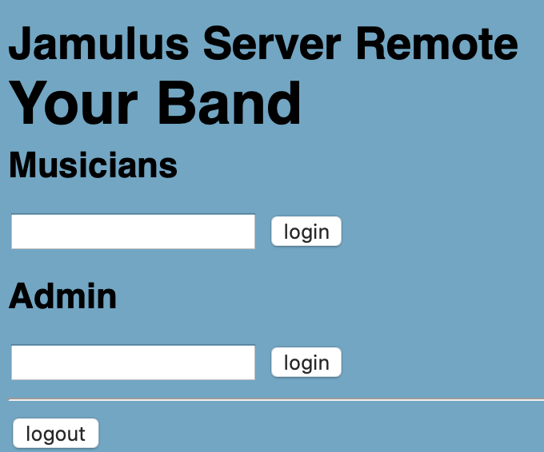
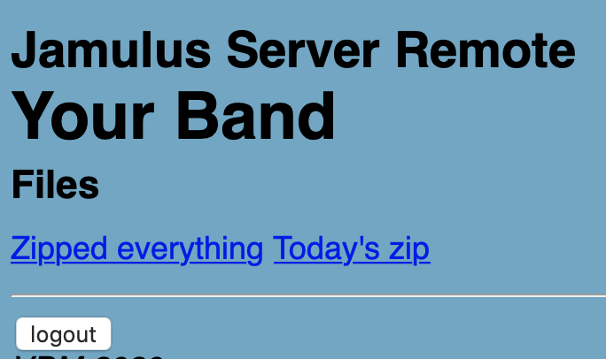
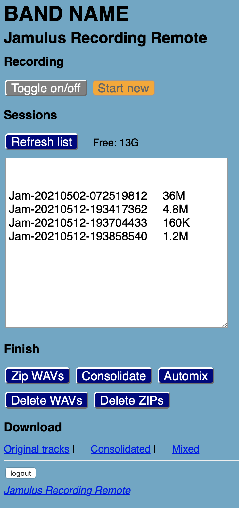
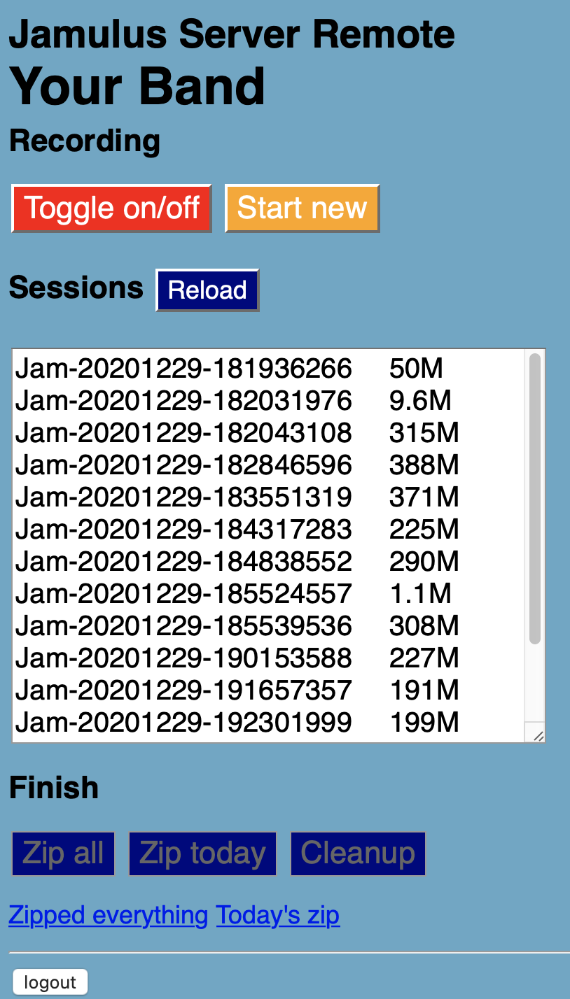

# Jamulus Recording Remote - 0.3 (2021-01-04)
A light-weight web-based interface for Jamulus headless server when installed on a Linux system. No frills, supersimple.

Jamulus Server Remote allows to start and stop recordings, and at the end zip them to be downloaded via the Web. While in principle it can be installed on any Linux distribution, at the moment it has been tested on Ubuntu 18.04 installed on an AWS EC2 machine only. If you have to create a new server on AWS, just follow the instructions below and will be very easy. Adapting a running system requires some adaptation (details in the Details section below). 

**Warning: use it at your own risk** 
*Jamulus Server Remote has not yet been thoroughly examined for security issues, thus use it at your own risk, in particular if on a server running continuously. In particular, to be safe, Apache has to be set on https only.*

## Prerequisites
Jamulus should be installed according to official [instructions](https://jamulus.io/wiki/Server-Linux) (using the installscript included in the `distributions` folder is perfectly okay), set as systemd service, and with the suggested additional services for beginning and toggling recording. 
The server must be started with the recording directory set to a directory accessible to apache (e.g., `-R /var/www/html/recordings`) and the `--norecord` option, to initially disable recording. Having the recording directory in the same directory of the PHP scripts makes things simpler.

If you do not have already installed Jamulus server, you may quickly do it as follows (for Ubuntu):

`wget https://raw.githubusercontent.com/corrados/jamulus/master/distributions/installscripts/install4ubuntu.sh`

`sh install4ubuntu.sh`

Other install scripts can be found here: https://github.com/corrados/jamulus/tree/master/distributions

The rest of this README refers to Ubuntu, but it should be easily adaptable to other Linux platforms.

## Quick install

**If you have a personalised install of Jamulus already running, do not follow these instructions, but read the details at the bottom to adapt the system to your local needs.**

The below commands are also summarized in https://github.com/vdellamea/jamulus-server-remote/blob/main/QUICK-INSTALL.md for super-quick installation **on a fresh installation** on Ubuntu 18.04.

Be sure to have zip:

`sudo apt-get install zip`

Download the code:

`wget https://github.com/vdellamea/jamulus-server-remote/archive/main.zip`

Unzip it:

`unzip main.zip`

enter the unzipped directory:

`cd jamulus-server-remote-main`

Run the `install-service.sh` script to install and start Jamulus as systemd service, as well as the two services needed for toggling recording and starting a new one. If you already have a service installed, please do not run the script, but look at it and run only the commands needed to adapt to your system.

Then run the `install-remote.sh` script to install the web-based remote. With a browser, go to the server address (IP or domain), and you will find the interface; enter the password you have set in the configuration.

## Configuration 

In principle, the `config.php` (under `/var/www/html`) is the only place where to put hands: password, paths, and also the real shell commands to allow for personalization. Change the following values according to your local configuration or taste:

This is at your taste: server, band name, your cat name...:

`$SERVERNAME="Your band name";`

Please change the passwords:

`$ADMINPASSWORD= "******";`

`$MUSICIANSPASSWORD= "******";`

This is the recording directory set also in the Jamulus parameters and in the `jamulus.service` file:

`$RECORDINGS="/var/www/html/recording/";`

If you set this one to true, in the Session box you can see some extra output, which can help in debugging:

`$DEBUG=false;`

Commands may need personalization if you want to adapt the scripts to an already existing installation. Here the examples:

 `"toggle" => "sudo /bin/systemctl kill -s SIGUSR2 jamulus ",`
 
 `"newrec" => "sudo /bin/systemctl kill -s SIGUSR1 jamulus ",`
 
 `"compress" => "cd $RECORDINGS ; rm session.zip; zip -r session.zip Jam* ",`
 
 `"compressday" => "cd $RECORDINGS ; rm $today.zip; zip -r $today.zip Jam-$today-* ", `
 
 `"cleanup" => "rm -fr $RECORDINGS/Jam* ",`
 
 `"listrec" => "du -sh $RECORDINGS/Jam* ",`

## Usage
Access to the commands is protected by the password you set in the configuration file. Musicians too need to enter a password to access zipped files.

 

At each first access, the interface expects Jamulus to have *recording disabled*. Thus the "toggle on/off" button is off, and the "Start new" is disabled. This also means that just one admin at a time must access the interface, to avoid mishaps. Then, the toggle button activate/disactivate recording, the Start new button start a new recording. 

 

At the end of each execution, buttons trigger a refresh of the Sessions textarea, where recordings are shown with their size. However, you may also reload to update the size of the last recording. 

At the end, you can zip all the sessions (as `session.zip` file), or just those of the current day (as `YYYYMMDD.zip` file). Cleanup deletes all sessions, so be careful. Depending on how you set the `cleanup` command in `config.php`, it deletes or it does not delete the compressed archives. 

 *No need to check the rest if you installed from scratch as described above.*
 
## Details for adapting to an already installed service
The following description is aimed at explaining what the installation script does, and it can be useful for those that want to install the interface on an already running server, or on a different distribution, or for any other reason.

Download the code from this repository; the web-based interface itself is only including 4 files. Move the 4 files in the `/var/www/html` directory (or similar place in other distributions). 

### The service 
The service file now allows for writing in the home directory of the user, which is created when creating the user. However, this is not mandatory: if you installed everything according to official instructions, the jamulus user likely will not have a home directory. 

### Extending privileges
This is the tricky part. You have to give privileges to Apache for running commands as `sudo` by modifying the `sudoers` file or, better, adding a file in `sudoers.d`. However, any mistake in doing this may result in loosing sudo privileges, thus use exclusively the `sudo visudo` command if you have to modify something, because it does syntax checks. E.g.:

`sudo visudo -f /etc/sudoers.d/jamulus`

and then add lines like these for each command you want to give sudo privileges to www-data:

`www-data ALL=(ALL)NOPASSWD: /bin/systemctl kill -s SIGUSR1 jamulus`

`www-data ALL=(ALL)NOPASSWD: /bin/systemctl kill -s SIGUSR2 jamulus`

Followed but one or two newline.

Be very careful. `visudo` does syntax checking and avoids mistakes, but if you use a different editor and make a mistake, all sudo privileges become locked.

Since files are written by the user `jamulus`, and then could not be deleted by `www-data` (the user under which Apache+PHP does the job), set gid to give www-data as group to any subfolder/file: 

`mkdir /home/jamulus/recording`

`sudo chown www-data /home/jamulus/recording/`

`sudo chgrp www-data /home/jamulus/recording/`

`sudo chmod g+s /home/jamulus/recording/`

`sudo setfacl -d -m g::rwx /home/jamulus/recording/`

In the above commands, you may substitute the `/home/jamulus/recording/` directory with your own. Remember to change it also in `config.php` and in `jamulus.service` (however, the latter might not be needed if you already set it up for your installation). 

